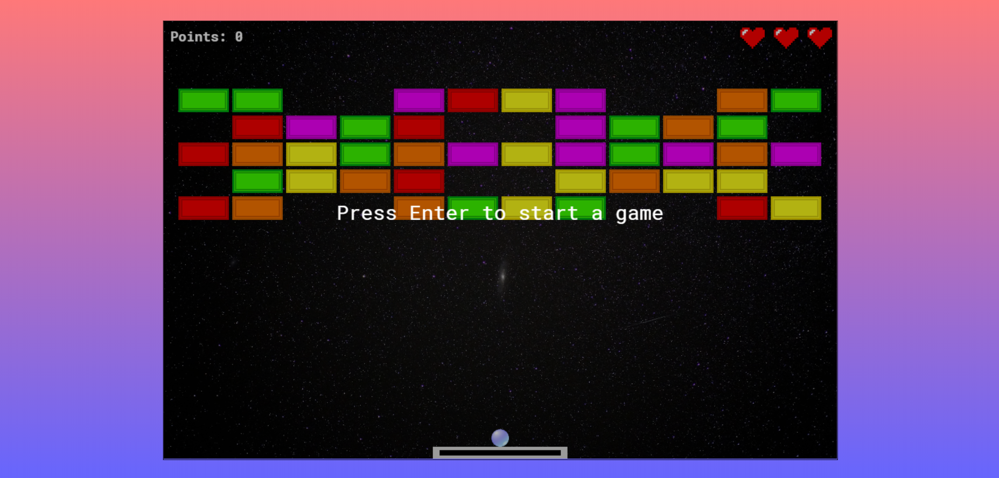
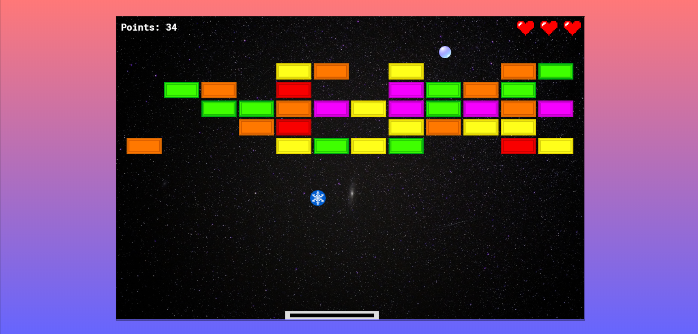
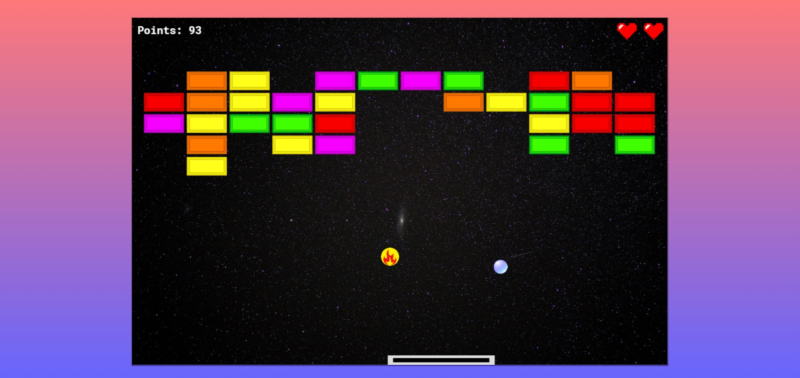

# Cosmo brick
> Cosmo brick is a game where player should break bricks with the help of a flying ball. But the most difficult part is to prevent falling down of the ball. It is also possible to catch some other things except ball. Some of them will simplify player's mission, others will make it harder.

## Table of contents
- [Cosmo brick](#cosmo-brick)
  - [Table of contents](#table-of-contents)
  - [General info](#general-info)
  - [Screenshots](#screenshots)
  - [Technologies](#technologies)
  - [Status](#status)
  - [Inspiration](#inspiration)

## General info
This project was created to learn canvas and basics of game development in JavaScript. The idea of the game is not original but, what is more valuable, I learned a lot of new things making this project. The project is based on a video tutorial, but I also added some additional things like additions that change a ball's speed or width of the paddle.

The game has only 6 levels but a user can play it infinitely because the games loops through the levels array and change strength of random bricks. So levels look differently every time. A speed of the ball is also increased from level to level so the game becomes more and more difficult.

Before starting a game and after live loss user can set a paddle's possition to the one he or she prefers, but it doesn't work after normal pause initialised by users.

## Screenshots

## Technologies
* JavaScript
* HTML
* SASS
* Webpack 4

## Status
Project is _finished_, but it doesn't mean I will never add something new to it.

## Inspiration
Project is based on <a href="https://www.youtube.com/watch?v=3EMxBkqC4z0">Intro to Game Development with JavaScript</a> tutorial from freeCodeCamp.org youtube channel.
